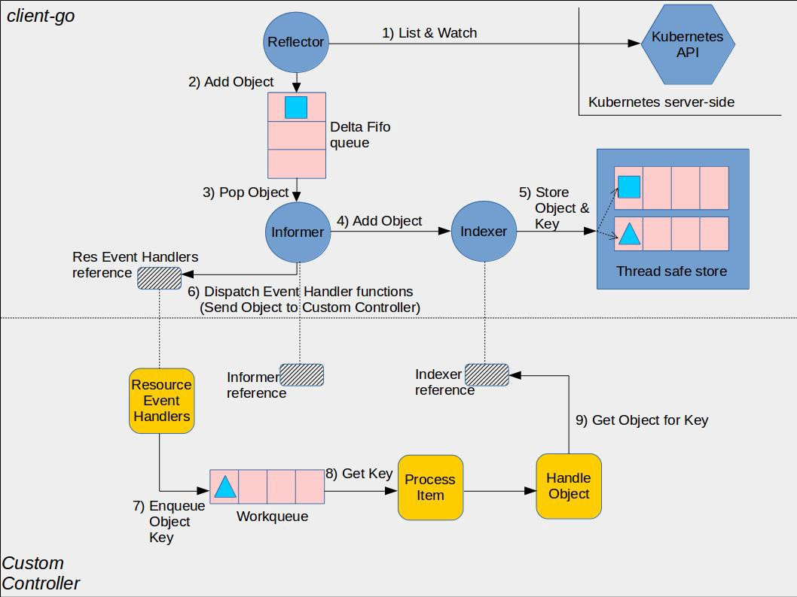

+++
title = "How to optimize the Kubernetes client memory usage in a large-scale cluster?"
date = 2026-07-08
description = "Techniques to reduce client-go memory usage: WithTransform, ResourceVersion, WatchList, memory limits"

[taxonomies]
tags = ["Kubernetes"]
+++

> "Large-scale" here refers not only to many nodes, but to many resources — like Jobs or ServiceMonitors.

## Background

When extending Kubernetes cluster functionality, we often use [k8s.io/client-go](https://pkg.go.dev/k8s.io/client-go) to interact with the Kubernetes API server, List/Watch resources, and act on them. For example, [kube-state-metrics](https://github.com/kubernetes/kube-state-metrics) Lists/Watches Pods, Deployments, Jobs, DaemonSets, etc., and exposes Prometheus metrics from resource data. [Prometheus Operator](https://github.com/prometheus-operator/prometheus-operator) Lists/Watches ServiceMonitors, PodMonitors, etc., to update Prometheus configurations.

[k8s.io/client-go](https://pkg.go.dev/k8s.io/client-go) uses [SharedIndexInformer](https://pkg.go.dev/k8s.io/client-go@v0.36.0/tools/cache#SharedIndexInformer) to cache resources in memory, reducing requests to the API server and easing its CPU/memory pressure. The catch: SharedIndexInformer first Lists **all** resources (e.g., all Jobs or all ServiceMonitors). If the cluster has a large number of resources, caching everything in memory can cause client memory usage to spike, risking OOM[^1] if limits are misconfigured or node resources are tight.

## Mitigation Strategies

As client developers, we should optimize code to reduce memory usage. Here are several approaches I've gathered from reading Kubernetes component source code.

### 1. WithTransform

[WithTransform](https://pkg.go.dev/k8s.io/client-go@v0.36.0/informers#WithTransform)

```go
func WithTransform(transform cache.TransformFunc) SharedInformerOption
```

WithTransform registers a TransformFunc in the Delta FIFO queue. Before objects are added to the queue (on List/Watch add/update/delete), they are trimmed — unused fields are stripped out, never cached in memory.



Image source: <https://github.com/kubernetes/kubernetes/blob/ecf6decece6a6de25a57aad9ba90b6ce580f6f78/pkg/features/kube_features.go#L2353-L2359>

For example, kube-controller-manager uses WithTransform to strip `.metadata.managedFields` from API server responses[^2]:

```go
trim := func(obj interface{}) (interface{}, error) {
	if accessor, err := meta.Accessor(obj); err == nil {
		if accessor.GetManagedFields() != nil {
			accessor.SetManagedFields(nil)
		}
	}
	return obj, nil
}
sharedInformers := informers.NewSharedInformerFactoryWithOptions(client, ResyncPeriod(s)(), informers.WithTransform(trim))
```

Implementation: <https://github.com/kubernetes/kubernetes/pull/118455>

### 2. Set ListOptions.ResourceVersion to "0"

When strong consistency isn't required, set `ResourceVersion` to `"0"` to read from the API server's watch cache. This improves performance and reduces etcd load, at the cost of potentially stale data.

As of Kubernetes 1.36, omitting `ResourceVersion` (or setting it to `""`) also reads from the watch cache but guarantees consistency.

Example from kube-state-metrics[^3]:

```go
if i.useAPIServerCache {
	options.ResourceVersion = "0"
}
```

Implementation: <https://github.com/kubernetes/kube-state-metrics/pull/1548>

More on Resource versions: [Resource versions](https://kubernetes.io/docs/reference/using-api/api-concepts/#resource-versions)

### 3. WatchListCompression Feature Gate[^4]

Enables gzip compression for WatchList requests. Enabled by default in Kubernetes 1.37+.

### 4. WatchListClient Feature Gate[^5]

Enables the WatchList client on the client side to stream List responses instead of fetching chunks. Enabled by default in Kubernetes v1.32 and v1.34+[^6].

```go
genericfeatures.WatchList: {
	{Version: version.MustParse("1.27"), Default: false, PreRelease: featuregate.Alpha},
	{Version: version.MustParse("1.32"), Default: true, PreRelease: featuregate.Beta},
	{Version: version.MustParse("1.33"), Default: false, PreRelease: featuregate.Beta},
	{Version: version.MustParse("1.34"), Default: true, PreRelease: featuregate.Beta},
},
```

kube-apiserver and kube-controller-manager implementation: <https://github.com/kubernetes/kubernetes/pull/132704>

### 5. Set ListOptions.Limit

Configure `Limit` on List calls to cap the maximum number of objects returned per response. Note: if the WatchListClient feature gate is enabled, the [Reflector](https://pkg.go.dev/k8s.io/client-go@v0.36.0/tools/cache#Reflector) in client-go will only make Watch calls.

kube-state-metrics implementation: <https://github.com/kubernetes/kube-state-metrics/pull/2626>

### 6. Set a Memory Soft Limit[^7]

From Go's perspective, you can set a memory soft limit to tune GC frequency and release memory.

Three ways:

- Set the `GOMEMLIMIT` environment variable
- Use [runtime/debug.SetMemoryLimit](https://pkg.go.dev/runtime/debug#SetMemoryLimit) at runtime
- Use the `github.com/KimMachineGun/automemlimit` package to auto-detect cgroup memory limits

kube-state-metrics auto-detection implementation: <https://github.com/kubernetes/kube-state-metrics/pull/2447>

## Community Efforts

> The Kubernetes community continues to optimize — including consistent reads from cache, streaming List responses, and server-side sharded List and Watch.

Related reading:

- [Kubernetes v1.31: Accelerating Cluster Performance with Consistent Reads from Cache](https://kubernetes.io/blog/2026/05/06/kubernetes-v1-36-server-side-sharded-list-and-watch/)
- [Kubernetes v1.33: Streaming List responses](https://kubernetes.io/blog/2025/05/09/kubernetes-v1-33-streaming-list-responses/)
- [Kubernetes v1.36: Server-Side Sharded List and Watch](https://kubernetes.io/blog/2026/05/06/kubernetes-v1-36-server-side-sharded-list-and-watch/)

## Summary

There are now many ways to reduce Kubernetes client memory usage — configuring ListOptions fields, feature gates, transform functions, and memory limits. The Kubernetes community continues to improve [SharedIndexInformer](https://pkg.go.dev/k8s.io/client-go@v0.36.0/tools/cache#SharedIndexInformer) and List/Watch calls.

[^1]: <https://en.wikipedia.org/wiki/Out_of_memory>

[^2]: <https://github.com/kubernetes/kubernetes/blob/ecf6decece6a6de25a57aad9ba90b6ce580f6f78/cmd/kube-controller-manager/app/controllermanager.go#L531-L551>

[^3]: <https://github.com/kubernetes/kube-state-metrics/blob/v2.19.0/pkg/watch/watch.go#L114-L116>

[^4]: <https://github.com/kubernetes/kubernetes/pull/139308>

[^5]: <https://github.com/kubernetes/enhancements/tree/master/keps/sig-api-machinery/3157-watch-list>

[^6]: <https://github.com/kubernetes/kubernetes/blob/ecf6decece6a6de25a57aad9ba90b6ce580f6f78/pkg/features/kube_features.go#L2353-L2359>

[^7]: <https://go.dev/doc/gc-guide#Memory_limit>
