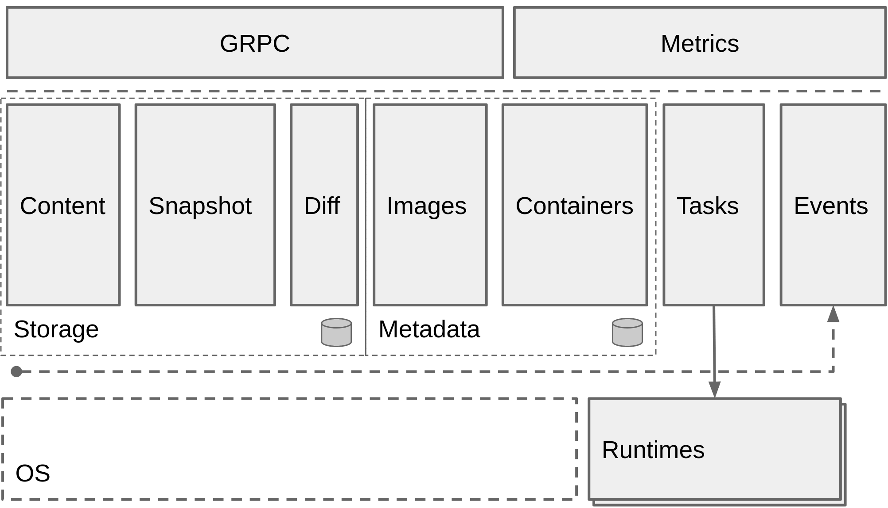
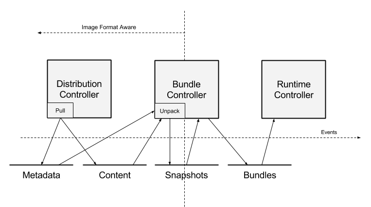

+++
title = "containerd Design"
weight = 31

[taxonomies]
tags = ["Containers"]
+++

## Architecture

To ensure clean separation of concerns, we have organized the units of
containerd's behavior into _components_. _Components_ are roughly organized
into _subsystems_. _Components_ that bridge subsystems may be referred to as
_modules_. _Modules_ typically provide cross-cutting functionality, such as
persistent storage or event distribution. Understanding these _components_ and
their relationships is key to modifying and extending the system.

This document will cover very high-level interaction. For details on each
module, please see the relevant design document.

The main goal of this architecture is to coordinate the creation and execution
of _bundles_. _Bundles_ contain configuration, metadata and root filesystem
data and are consumed by the _runtime_. A _bundle_ is the on-disk
representation of a runtime container. _Bundles_ are mutable and can be passed
to other systems for modification or packed up and distributed. In practice, it
is simply a directory on the filesystem.



Note that while these architectural ideas are important to understand the
system, code layout may not reflect the exact architecture. These ideas should
be used as a guide for placing functionality and behavior and understanding the
thought behind the design.

## Subsystems

External users interact with services, made available via a GRPC API.

- **_Bundle_**: The bundle service allows the user to extract and pack bundles
  from disk images.
- **_Runtime_**: The runtime service supports the execution of _bundles_,
  including the creation of runtime containers.

Typically, each subsystem will have one or more related _controller_ components
that implement the behavior of the _subsystem_. The behavior of the _subsystem_
may be exported for access via corresponding _services_.

## Modules

In addition to the subsystems, we have several components that may cross
subsystem boundaries, referenced to as components. We have the following
components:

- **_Executor_**: The executor implements the actual container runtime.
- **_Supervisor_**: The supervisor monitors and reports container state.
- **_Metadata_**: Stores metadata in a graph database. Use to store any
  persistent references to images and bundles. Data entered into the
  database will have schemas coordinated between components to provide access
  to arbitrary data. Other functionality includes hooks for garbage collection
  of on-disk resources.
- **_Content_**: Provides access to content addressable storage. All immutable
  content will be stored here, keyed by content hash.
- **_Snapshot_**: Manages filesystem snapshots for container images. This is
  analogous to the graphdriver in Docker today. Layers are unpacked into
  snapshots.
- **_Events_**: Supports the collection and consumption of events for providing
  consistent, event driven behavior and auditing. Events may be replayed to
  various _modules_
- **_Metrics_**: Each components will export several metrics, accessible via
  the metrics API. (We may want to promote this to a subsystem.

## Client-side components

Some components are implemented on the client side for flexibility:

- **_Distribution_**: Functions for pulling and pushing images

## Data Flow

As discussed above, the concept of a _bundle_ is central to containerd. Below
is a diagram illustrating the data flow for bundle creation.



Let's take pulling an image as a demonstrated example:

1. Instruct the Distribution layer to pull a particular image. The distribution
   layer places the image content into the _content store_. The image name and
   root manifest pointers are registered with the metadata store.
2. Once the image is pulled, the user can instruct the bundle controller to
   unpack the image into a bundle. Consuming from the content store, _layers_
   from the image are unpacked into the _snapshot_ component.
3. When the snapshot for the rootfs of a container is ready, the _bundle
   controller_ can use the image manifest and config to prepare the execution
   configuration. Part of this is entering mounts into the execution config
   from the _snapshot_ module.
4. The prepared bundle is then passed off to the _runtime_ subsystem for
   execution. It reads the bundle configuration to create a running container.

## Data Flow

In the past, container systems have hidden the complexity of pulling container
images, hiding many details and complexity. This document intends to shed light
on that complexity and detail how a "pull" operation will look from the
perspective of a containerd user. We use the _bundle_ as the target object in
this workflow, and walk back from there to describe the full process. In this
context, we describe both pulling an image and creating a bundle from that
image.

With containerd, we redefine the "pull" to comprise the same set of steps
encompassed in prior container engines. In this model, an image defines a
collection of resources that can be used to create a _bundle_. There is no
specific format or object called an image. The goal of the pull is to produce a
set of steps is to resolve the resources that comprise an image, with the
separation providing lifecycle points in the process.

A reference implementation of the complete "pull", performed client-side, will
be provided as part of containerd, but there may not be a single "pull" API
call.

A rough diagram of the dataflow, along with the relevant components, is below.


While the process proceeds left to right in the diagram, this document is
written right to left. By working through this process backwards, we can best
understand the approach employed by containerd.

## Running a Container

For containerd, we'd generally like to retrieve a _bundle_. This is the
runtime, on-disk container layout, which includes the filesystem and
configuration required to run the container.

Generically, speaking, we can say we have the following directory:

```
config.json
rootfs/
```

The contents of `config.json` isn't interesting in this context, but for
clarity, it may be the runc config or a containerd specific configuration file
for setting up a running container. The `rootfs` is a directory where
containerd will setup the runtime container's filesystem.

While containerd doesn't have the concept of an image, we can effectively build
this structure from an image, as projected into containerd. Given this, we can
say that requirements for running a container are to do the following:

1. Convert the configuration from the container image into the target format
   for the containerd runtime.
2. Reproduce the root filesystem from the container image. While we could
   unpack this into `rootfs` in the bundle, we can also just pass this as a set
   of mounts to the container configuration.

The above defines the framework in which we will operate. Put differently, we
can say that we want to create a bundle by creating these two components of a
bundle.

## Creating a Bundle

Now that we've defined what is required to run a container, a _bundle_, we need
to create one.

Let's say we have the following:

```
ctr run ubuntu
```

This does no pulling of images. It only takes the name and creates a _bundle_.
Broken down into steps, the process looks as follows:

1. Lookup the digest of the image in metadata store.
2. Resolve the manifest in the content store.
3. Resolve the layer snapshots in the snapshot subsystem.
4. Transform the config into the target bundle format.
5. Create a runtime snapshot for the rootfs of the container, including resolution of mounts.
6. Run the container.

From this, we can understand the required resources to _pull_ an image:

1. An entry in the metadata store a name pointing at a particular digest.
2. The manifest must be available in the content store.
3. The result of successively applied layers must be available as a snapshot.

## Unpacking Layers

While this process may be pull or run driven, the idea is quite simple. For
each layer, apply the result to a snapshot of the previous layer. The result
should be stored under the chain id (as defined by OCI) of the resulting
application.

## Pulling an Image

With all the above defined, pulling an image simply becomes the following:

1. Fetch the manifest for the image, verify and store it.
2. Fetch each layer of the image manifest, verify and store them.
3. Store the manifest digest under the provided name.

Note that we leave off using the name to resolve a particular location. We'll
leave that for another doc!

## Container Lifecycle

While containerd is a daemon that provides API to manage multiple containers, the containers themselves are not tied to the lifecycle of containerd. Each container has a shim that acts as the direct parent for the container's processes as well as reporting the exit status and holding onto the STDIO of the container. This also allows containerd to crash and restore all functionality to containers.

### containerd

The daemon provides an API to manage multiple containers. It can handle locking in process where needed to coordinate tasks between subsystems. While the daemon does fork off the needed processes to run containers, the shim and runc, these are re-parented to the system's init.

### shim

Each container has its own shim that acts as the direct parent of the container's processes. The shim is responsible for keeping the IO and/or pty master of the container open, writing the container's exit status for containerd, and reaping the container's processes when they exit. Since the shim owns the container's pty master, it provides an API for resizing.

Overall, a container's lifecycle is not tied to the containerd daemon. The daemon is a management API for multiple container whose lifecycle is tied to one shim per container.

## Snapshots

Docker containers, from the beginning, have long been built on a snapshotting
methodology known as _layers_. _Layers_ provide the ability to fork a
filesystem, make changes then save the changeset back to a new layer.

Historically, these have been tightly integrated into the Docker daemon as a
component called the `graphdriver`. The `graphdriver` allows one to run the
docker daemon on several different operating systems while still maintaining
roughly similar snapshot semantics for committing and distributing changes to
images.

The `graphdriver` is deeply integrated with the import and export of images,
including managing layer relationships and container runtime filesystems. The
behavior of the `graphdriver` informs the transport of image formats.

In this document, we propose a more flexible model for managing layers. It
focuses on providing an API for the base snapshotting functionality without
coupling so tightly to the structure of images and their identification. The
minimal API simplifies behavior without sacrificing power. This makes the
surface area for driver implementations smaller, ensuring that behavior is more
consistent between implementations.

These differ from the concept of the graphdriver in that the _Snapshotter_
has no knowledge of images or containers. Users simply prepare and commit
directories. We also avoid the integration between graph drivers and the tar
format used to represent the changesets.

The best aspect is that we can get to this model by refactoring the existing
graphdrivers, minimizing the need for new code and sprawling tests.

### Scope

In the past, the `graphdriver` component has provided quite a lot of
functionality in Docker. This includes serialization, hashing, unpacking,
packing, mounting.

The _Snapshotter_ will only provide mount-oriented snapshot
access with minimal metadata. Serialization, hashing, unpacking, packing and
mounting are not included in this design, opting for common implementations
between graphdrivers, rather than specialized ones. This is less of a problem
for performance since direct access to changesets is provided in the
interface.

### Architecture

The _Snapshotter_ provides an API for allocating, snapshotting and mounting
abstract, layer-based filesystems. The model works by building up sets of
directories with parent-child relationships, known as _Snapshots_.

A _Snapshot_ represents a filesystem state. Every snapshot has a parent,
where the empty parent is represented by the empty string. A diff can be taken
between a parent and its snapshot to create a classic layer.

Snapshots are best understood by their lifecycle. _Active_ snapshots are always
created with `Prepare` or `View` from a _Committed_ snapshot (including the
empty snapshot). _Committed_ snapshots are always created with
`Commit` from an _Active_ snapshot. Active snapshots never become committed
snapshots and vice versa. All snapshots may be removed.

After mounting an _Active_ snapshot, changes can be made to the snapshot. The
act of committing creates a _Committed_ snapshot. The committed snapshot will
inherit the parent of the active snapshot. The committed snapshot can then be
used as a parent. Active snapshots can never be used as a parent.

The following diagram demonstrates the relationships of snapshots:


In this diagram, you can see that the active snapshot _a_ is created by calling
`Prepare` with the committed snapshot _P<sub>0</sub>_. After modification, _a_
becomes _a'_ and a committed snapshot _P<sub>1</sub>_ is created by calling
`Commit`. _a'_ can be further modified as _a''_ and a second committed snapshot
can be created as _P<sub>2</sub>_ by calling `Commit` again. Note here that
_P<sub>2</sub>_'s parent is _P<sub>0</sub>_ and not _P<sub>1</sub>_.

### Operations

The manifestation of _snapshots_ is facilitated by the `Mount` object and
user-defined directories used for opaque data storage. When creating a new
active snapshot, the caller provides an identifier called the _key_. This
operation returns a list of mounts that, if mounted, will have the fully
prepared snapshot at the mounted path. We call this the _prepare_ operation.

Once a snapshot is _prepared_ and mounted, the caller may write new data to the
snapshot. Depending on the application, a user may want to capture these changes
or not.

For a read-only view of a snapshot, the _view_ operation can be used. Like
_prepare_, _view_ will return a list of mounts that, if mounted, will have the
fully prepared snapshot at the mounted path.

If the user wants to keep the changes, the _commit_ operation is employed. The
_commit_ operation takes the _key_ identifier, which represents an active
snapshot, and a _name_ identifier. A successful result will create a _committed_
snapshot that can be used as the parent of new _active_ snapshots when
referenced by the _name_.

If the user wants to discard the changes in an active snapshot, the _remove_
operation will release any resources associated with the snapshot. The mounts
provided by _prepare_ or _view_ should be unmounted before calling this method.

If the user wants to discard committed snapshots, the _remove_ operation can
also be used, but any children must be removed before proceeding.

For detailed usage information, see the
[GoDoc](https://godoc.org/github.com/containerd/containerd/snapshots#Snapshotter).

### Graph metadata

As snapshots are imported into the container system, a "graph" of snapshots and
their parents will form. Queries over this graph must be a supported operation.

### How snapshots work

To flesh out the _Snapshots_ terminology, we are going to demonstrate the use of
the _Snapshotter_ from the perspective of importing layers. We'll use a Go API
to represent the process.

#### Importing a Layer

To import a layer, we simply have the _Snapshotter_ provide a list of
mounts to be applied such that our destination will capture a changeset. We start
out by getting a path to the layer tar file and creating a temp location to
unpack it to:

    layerPath, tmpDir := getLayerPath(), mkTmpDir() // just a path to layer tar file.

We start by using a _Snapshotter_ to _Prepare_ a new snapshot transaction, using
a _key_ and descending from the empty parent "":

    mounts, err := snapshotter.Prepare(key, "")
    if err != nil { ... }

We get back a list of mounts from `Snapshotter.Prepare`, with the `key`
identifying the active snapshot. Mount this to the temporary location with the
following:

    if err := mount.All(mounts, tmpDir); err != nil { ... }

Once the mounts are performed, our temporary location is ready to capture
a diff. In practice, this works similar to a filesystem transaction. The
next step is to unpack the layer. We have a special function `unpackLayer`
that applies the contents of the layer to target location and calculates the
`DiffID` of the unpacked layer (this is a requirement for docker
implementation):

    layer, err := os.Open(layerPath)
    if err != nil { ... }
    digest, err := unpackLayer(tmpLocation, layer) // unpack into layer location
    if err != nil { ... }

When the above completes, we should have a filesystem the represents the
contents of the layer. Careful implementations should verify that digest
matches the expected `DiffID`. When completed, we unmount the mounts:

    unmount(mounts) // optional, for now

Now that we've verified and unpacked our layer, we commit the active
snapshot to a _name_. For this example, we are just going to use the layer
digest, but in practice, this will probably be the `ChainID`:

    if err := snapshotter.Commit(digest.String(), key); err != nil { ... }

Now, we have a layer in the _Snapshotter_ that can be accessed with the digest
provided during commit. Once you have committed the snapshot, the active
snapshot can be removed with the following:

    snapshotter.Remove(key)

#### Importing the Next Layer

Making a layer depend on the above is identical to the process described
above except that the parent is provided as `parent` when calling
`Snapshotter.Prepare`, assuming a clean `tmpLocation`:

    mounts, err := snapshotter.Prepare(tmpLocation, parentDigest)

We then mount, apply and commit, as we did above. The new snapshot will be
based on the content of the previous one.

#### Running a Container

To run a container, we simply provide `Snapshotter.Prepare` the committed image
snapshot as the parent. After mounting, the prepared path can
be used directly as the container's filesystem:

    mounts, err := snapshotter.Prepare(containerKey, imageRootFSChainID)

The returned mounts can then be passed directly to the container runtime. If
one would like to create a new image from the filesystem, `Snapshotter.Commit`
is called:

    if err := snapshotter.Commit(newImageSnapshot, containerKey); err != nil { ... }

Alternatively, for most container runs, `Snapshotter.Remove` will be called to
signal the Snapshotter to abandon the changes.

## Mounts

Mounts are the main interaction mechanism in containerd. Container systems of
the past typically end up having several disparate components independently
perform mounts, resulting in complex lifecycle management and buggy behavior
when coordinating large mount stacks.

In containerd, we intend to keep mount syscalls isolated to the container
runtime component, opting to have various components produce a serialized
representation of the mount. This ensures that the mounts are performed as a
unit and unmounted as a unit.

From an architecture perspective, components produce mounts and runtime
executors consume them.

More imaginative use cases include the ability to virtualize a series of mounts
from various components without ever having to create a runtime. This will aid
in testing and implementation of satellite components.

### Structure

The `Mount` type follows the structure of the historic mount syscall:

| Field   | Type       | Description                                                                           |
| ------- | ---------- | ------------------------------------------------------------------------------------- |
| Type    | `string`   | Specific type of the mount, typically operating system specific                       |
| Target  | `string`   | Intended filesystem path for the mount destination.                                   |
| Source  | `string`   | The object which originates the mount, typically a device or another filesystem path. |
| Options | `[]string` | Zero or more options to apply with the mount, possibly `=`-separated key value pairs. |

We may want to further parameterize this to support mounts with various
helpers, such as `mount.fuse`, but this is out of scope, for now.
