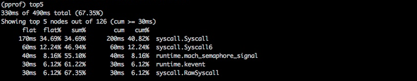
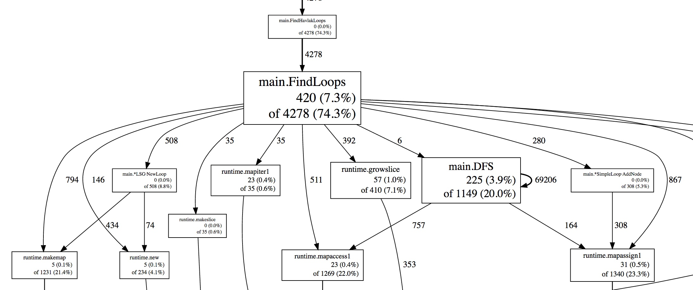
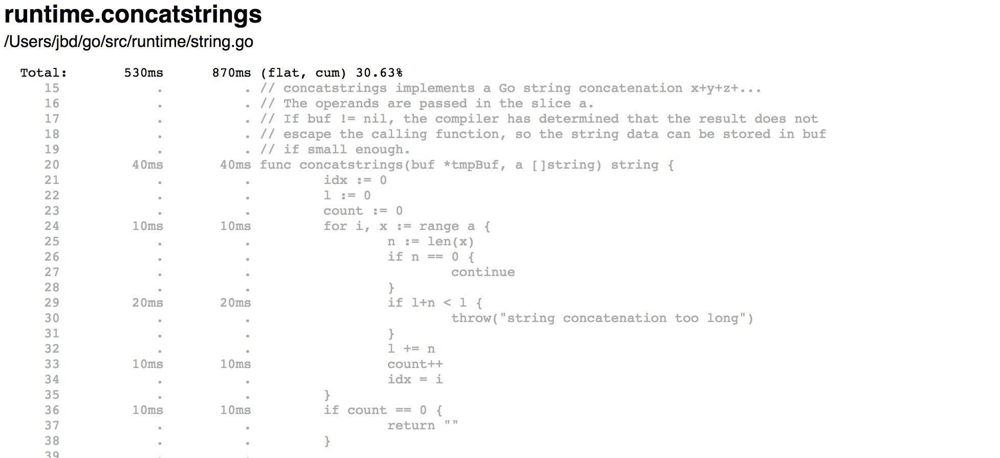
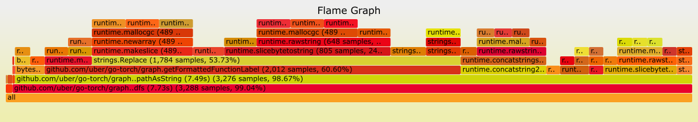
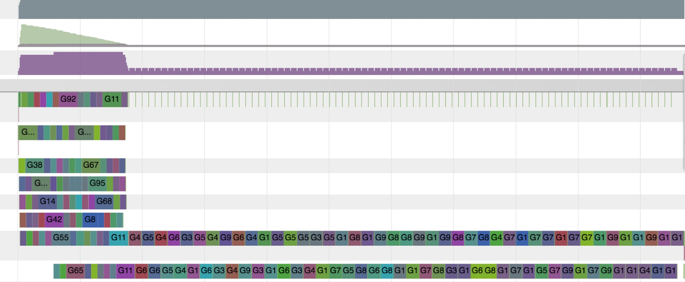

+++
title = "Go Diagnostics"
weight = 15
description = "Go profiling, tracing, debugging and runtime diagnostics"

[extra]
author = "The Go Team"
original_url = "https://go.dev/doc/diagnostics"

[taxonomies]
category = ["Go"]
+++

## Introduction

The Go ecosystem provides a large suite of APIs and tools to diagnose logic and performance problems in Go programs. This page summarizes the available tools and helps Go users pick the right one for their specific problem.

Diagnostics solutions can be categorized into the following groups:

* **Profiling**: Profiling tools analyze the complexity and costs of a Go program such as its memory usage and frequently called functions to identify the expensive sections of a Go program.
* **Tracing**: Tracing is a way to instrument code to analyze latency throughout the lifecycle of a call or user request. Traces provide an overview of how much latency each component contributes to the overall latency in a system. Traces can span multiple Go processes.
* **Debugging**: Debugging allows us to pause a Go program and examine its execution. Program state and flow can be verified with debugging.
* **Runtime statistics and events**: Collection and analysis of runtime stats and events provides a high-level overview of the health of Go programs. Spikes/dips of metrics helps us to identify changes in throughput, utilization, and performance.

Note: Some diagnostics tools may interfere with each other. For example, precise memory profiling skews CPU profiles and goroutine blocking profiling affects scheduler trace. Use tools in isolation to get more precise info.

## Profiling

Profiling is useful for identifying expensive or frequently called sections of code. The Go runtime provides [profiling data](https://pkg.go.dev/runtime/pprof/) in the format expected by the [pprof visualization tool](https://github.com/google/pprof/blob/master/doc/README.md). The profiling data can be collected during testing via `go test` or endpoints made available from the [net/http/pprof](https://pkg.go.dev/net/http/pprof/) package. Users need to collect the profiling data and use pprof tools to filter and visualize the top code paths.

Predefined profiles provided by the [runtime/pprof](https://pkg.go.dev/runtime/pprof) package:

* **cpu**: CPU profile determines where a program spends its time while actively consuming CPU cycles (as opposed to while sleeping or waiting for I/O).
* **heap**: Heap profile reports memory allocation samples; used to monitor current and historical memory usage, and to check for memory leaks.
* **threadcreate**: Thread creation profile reports the sections of the program that lead the creation of new OS threads.
* **goroutine**: Goroutine profile reports the stack traces of all current goroutines.
* **block**: Block profile shows where goroutines block waiting on synchronization primitives (including timer channels). Block profile is not enabled by default; use `runtime.SetBlockProfileRate` to enable it.
* **mutex**: Mutex profile reports the lock contentions. When you think your CPU is not fully utilized due to a mutex contention, use this profile. Mutex profile is not enabled by default, see `runtime.SetMutexProfileFraction` to enable it.

### What other profilers can I use to profile Go programs?

On Linux, [perf tools](https://perf.wiki.kernel.org/index.php/Tutorial) can be used for profiling Go programs. Perf can profile and unwind cgo/SWIG code and kernel, so it can be useful to get insights into native/kernel performance bottlenecks. On macOS, [Instruments](https://developer.apple.com/library/content/documentation/DeveloperTools/Conceptual/InstrumentsUserGuide/) suite can be used profile Go programs.

### Can I profile my production services?

Yes. It is safe to profile programs in production, but enabling some profiles (e.g. the CPU profile) adds cost. You should expect to see performance downgrade. The performance penalty can be estimated by measuring the overhead of the profiler before turning it on in production.

You may want to periodically profile your production services. Especially in a system with many replicas of a single process, selecting a random replica periodically is a safe option. Select a production process, profile it for X seconds for every Y seconds and save the results for visualization and analysis; then repeat periodically. Results may be manually and/or automatically reviewed to find problems. Collection of profiles can interfere with each other, so it is recommended to collect only a single profile at a time.

### What are the best ways to visualize the profiling data?

The Go tools provide text, graph, and [callgrind](http://valgrind.org/docs/manual/cl-manual.html) visualization of the profile data using [`go tool pprof`](https://github.com/google/pprof/blob/master/doc/README.md). Read [Profiling Go programs](https://go.dev/blog/profiling-go-programs) to see them in action.



Listing of the most expensive calls as text.



Visualization of the most expensive calls as a graph.

Weblist view displays the expensive parts of the source line by line in an HTML page. In the following example, 530ms is spent in the `runtime.concatstrings` and cost of each line is presented in the listing.



Visualization of the most expensive calls as weblist.

Another way to visualize profile data is a [flame graph](http://www.brendangregg.com/flamegraphs.html). Flame graphs allow you to move in a specific ancestry path, so you can zoom in/out of specific sections of code. The [upstream pprof](https://github.com/google/pprof) has support for flame graphs.



Flame graphs offers visualization to spot the most expensive code-paths.

### Am I restricted to the built-in profiles?

Additionally to what is provided by the runtime, Go users can create their custom profiles via [pprof.Profile](https://pkg.go.dev/runtime/pprof/#Profile) and use the existing tools to examine them.

### Can I serve the profiler handlers (/debug/pprof/...) on a different path and port?

Yes. The `net/http/pprof` package registers its handlers to the default mux by default, but you can also register them yourself by using the handlers exported from the package.

For example, the following example will serve the pprof.Profile handler on :7777 at /custom_debug_path/profile:

```go
package main

import (
	"log"
	"net/http"
	"net/http/pprof"
)

func main() {
	mux := http.NewServeMux()
	mux.HandleFunc("/custom_debug_path/profile", pprof.Profile)
	log.Fatal(http.ListenAndServe(":7777", mux))
}
```

## Tracing

Tracing is a way to instrument code to analyze latency throughout the lifecycle of a chain of calls. Go provides [golang.org/x/net/trace](https://godoc.org/golang.org/x/net/trace) package as a minimal tracing backend per Go node and provides a minimal instrumentation library with a simple dashboard. Go also provides an execution tracer to trace the runtime events within an interval.

Tracing enables us to:

* Instrument and analyze application latency in a Go process.
* Measure the cost of specific calls in a long chain of calls.
* Figure out the utilization and performance improvements. Bottlenecks are not always obvious without tracing data.

In monolithic systems, it's relatively easy to collect diagnostic data from the building blocks of a program. All modules live within one process and share common resources to report logs, errors, and other diagnostic information. Once your system grows beyond a single process and starts to become distributed, it becomes harder to follow a call starting from the front-end web server to all of its back-ends until a response is returned back to the user. This is where distributed tracing plays a big role to instrument and analyze your production systems.

Distributed tracing is a way to instrument code to analyze latency throughout the lifecycle of a user request. When a system is distributed and when conventional profiling and debugging tools don't scale, you might want to use distributed tracing tools to analyze the performance of your user requests and RPCs.

Distributed tracing enables us to:

* Instrument and profile application latency in a large system.
* Track all RPCs within the lifecycle of a user request and see integration issues that are only visible in production.
* Figure out performance improvements that can be applied to our systems. Many bottlenecks are not obvious before the collection of tracing data.

The Go ecosystem provides various distributed tracing libraries per tracing system and backend-agnostic ones.

### Is there a way to automatically intercept each function call and create traces?

Go doesn't provide a way to automatically intercept every function call and create trace spans. You need to manually instrument your code to create, end, and annotate spans.

### How should I propagate trace headers in Go libraries?

You can propagate trace identifiers and tags in the [`context.Context`](https://pkg.go.dev/context#Context). There is no canonical trace key or common representation of trace headers in the industry yet. Each tracing provider is responsible for providing propagation utilities in their Go libraries.

### What other low-level events from the standard library or runtime can be included in a trace?

The standard library and runtime are trying to expose several additional APIs to notify on low level internal events. For example, [`httptrace.ClientTrace`](https://pkg.go.dev/net/http/httptrace#ClientTrace) provides APIs to follow low-level events in the life cycle of an outgoing request. There is an ongoing effort to retrieve low-level runtime events from the runtime execution tracer and allow users to define and record their user events.

## Debugging

Debugging is the process of identifying why a program misbehaves. Debuggers allow us to understand a program's execution flow and current state. There are several styles of debugging; this section will only focus on attaching a debugger to a program and core dump debugging.

Go users mostly use the following debuggers:

* [Delve](https://github.com/go-delve/delve): Delve is a debugger for the Go programming language. It has support for Go's runtime concepts and built-in types. Delve is trying to be a fully featured reliable debugger for Go programs.
* [GDB](https://go.dev/doc/gdb): Go provides GDB support via the standard Go compiler and Gccgo. The stack management, threading, and runtime contain aspects that differ enough from the execution model GDB expects that they can confuse the debugger, even when the program is compiled with gccgo. Even though GDB can be used to debug Go programs, it is not ideal and may create confusion.

### How well do debuggers work with Go programs?

The `gc` compiler performs optimizations such as function inlining and variable registerization. These optimizations sometimes make debugging with debuggers harder. There is an ongoing effort to improve the quality of the DWARF information generated for optimized binaries. Until those improvements are available, we recommend disabling optimizations when building the code being debugged. The following command builds a package with no compiler optimizations:

```console
$ go build -gcflags=all="-N -l"
```

As part of the improvement effort, Go 1.10 introduced a new compiler flag `-dwarflocationlists`. The flag causes the compiler to add location lists that helps debuggers work with optimized binaries. The following command builds a package with optimizations but with the DWARF location lists:

```console
$ go build -gcflags="-dwarflocationlists=true"
```

### What's the recommended debugger user interface?

Even though both delve and gdb provides CLIs, most editor integrations and IDEs provides debugging-specific user interfaces.

### Is it possible to do postmortem debugging with Go programs?

A core dump file is a file that contains the memory dump of a running process and its process status. It is primarily used for post-mortem debugging of a program and to understand its state while it is still running. These two cases make debugging of core dumps a good diagnostic aid to postmortem and analyze production services. It is possible to obtain core files from Go programs and use delve or gdb to debug, see the [core dump debugging](https://go.dev/wiki/CoreDumpDebugging) page for a step-by-step guide.

## Runtime statistics and events

The runtime provides stats and reporting of internal events for users to diagnose performance and utilization problems at the runtime level.

Users can monitor these stats to better understand the overall health and performance of Go programs. Some frequently monitored stats and states:

* [`runtime.ReadMemStats`](https://pkg.go.dev/runtime/#ReadMemStats) reports the metrics related to heap allocation and garbage collection. Memory stats are useful for monitoring how much memory resources a process is consuming, whether the process can utilize memory well, and to catch memory leaks.
* [`debug.ReadGCStats`](https://pkg.go.dev/runtime/debug/#ReadGCStats) reads statistics about garbage collection. It is useful to see how much of the resources are spent on GC pauses. It also reports a timeline of garbage collector pauses and pause time percentiles.
* [`debug.Stack`](https://pkg.go.dev/runtime/debug/#Stack) returns the current stack trace. Stack trace is useful to see how many goroutines are currently running, what they are doing, and whether they are blocked or not.
* [`debug.WriteHeapDump`](https://pkg.go.dev/runtime/debug/#WriteHeapDump) suspends the execution of all goroutines and allows you to dump the heap to a file. A heap dump is a snapshot of a Go process' memory at a given time. It contains all allocated objects as well as goroutines, finalizers, and more.
* [`runtime.NumGoroutine`](https://pkg.go.dev/runtime#NumGoroutine) returns the number of current goroutines. The value can be monitored to see whether enough goroutines are utilized, or to detect goroutine leaks.

### Execution tracer

Go comes with a runtime execution tracer to capture a wide range of runtime events. Scheduling, syscall, garbage collections, heap size, and other events are collected by runtime and available for visualization by the go tool trace. Execution tracer is a tool to detect latency and utilization problems. You can examine how well the CPU is utilized, and when networking or syscalls are a cause of preemption for the goroutines.

Tracer is useful to:

* Understand how your goroutines execute.
* Understand some of the core runtime events such as GC runs.
* Identify poorly parallelized execution.

However, it is not great for identifying hot spots such as analyzing the cause of excessive memory or CPU usage. Use profiling tools instead first to address them.



Above, the go tool trace visualization shows the execution started fine, and then it became serialized. It suggests that there might be lock contention for a shared resource that creates a bottleneck.

See [`go tool trace`](https://go.dev/cmd/trace/) to collect and analyze runtime traces.

### GODEBUG

Runtime also emits events and information if [GODEBUG](https://pkg.go.dev/runtime/#hdr-Environment_Variables) environmental variable is set accordingly.

* GODEBUG=gctrace=1 prints garbage collector events at each collection, summarizing the amount of memory collected and the length of the pause.
* GODEBUG=inittrace=1 prints a summary of execution time and memory allocation information for completed package initialization work.
* GODEBUG=schedtrace=X prints scheduling events every X milliseconds.

The GODEBUG environmental variable can be used to disable use of instruction set extensions in the standard library and runtime.

* GODEBUG=cpu.all=off disables the use of all optional instruction set extensions.
* GODEBUG=cpu.*extension*=off disables use of instructions from the specified instruction set extension. *extension* is the lower case name for the instruction set extension such as *sse41* or *avx*.
