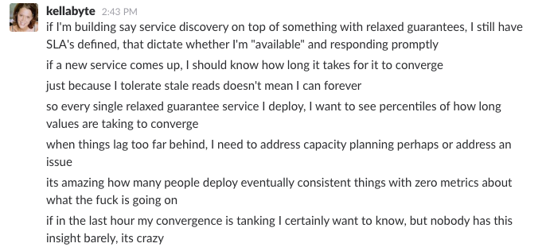
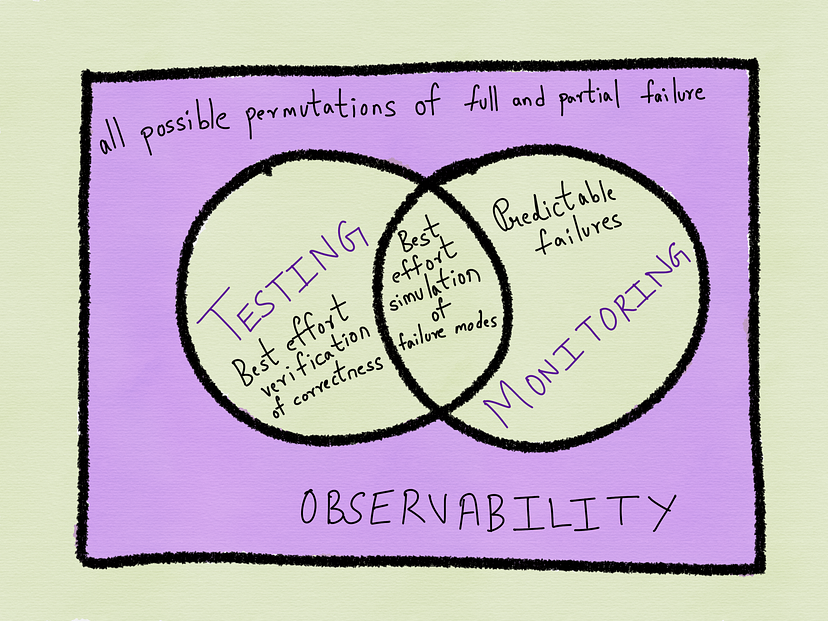
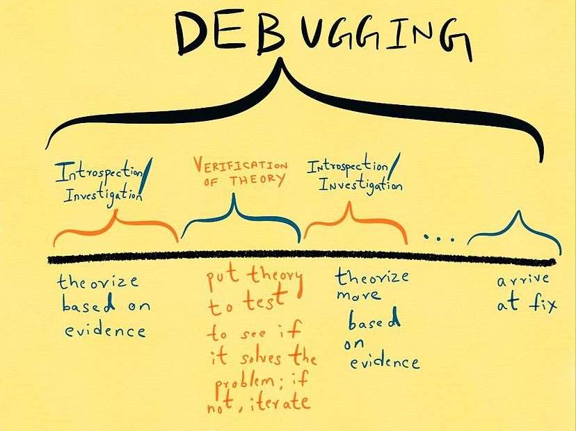
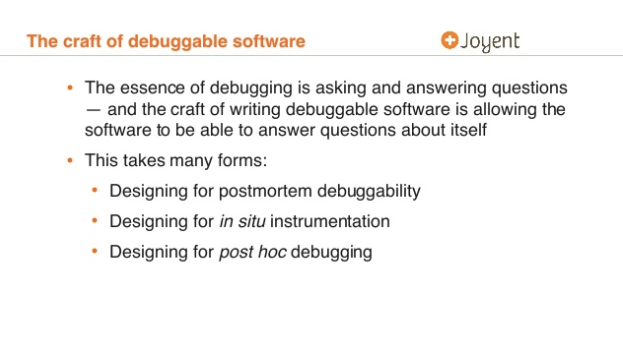
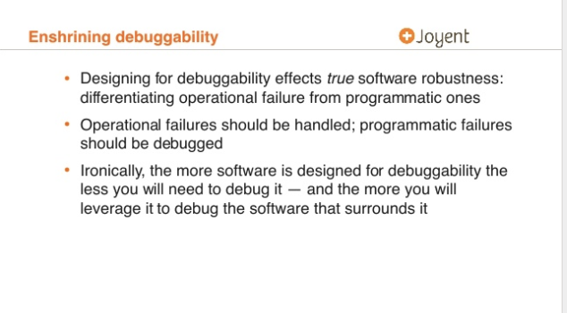
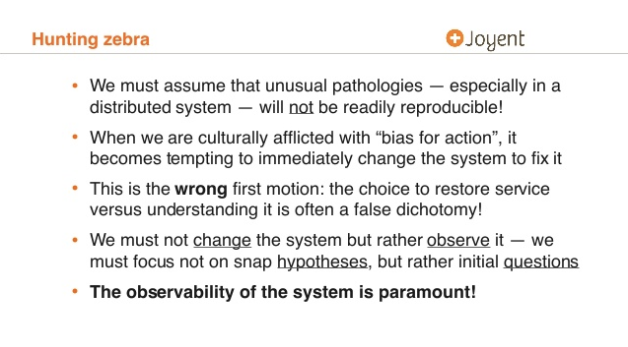

+++
title = "监控与可观测性"
weight = 51

[extra]
author = "Cindy Sridharan"
original_url = "https://copyconstruct.medium.com/monitoring-and-observability-8417d1952e1c"

[taxonomies]
tags = ["Observability"]
+++

在七月末与几位朋友共进午餐时，我们谈到了可观测性这个话题。我即将在不到一个月后的 [Velocity](https://conferences.oreilly.com/velocity/vl-ny) 大会上做一个名为 **云原生时代的监控** 的演讲，所以这段时间我一直在与朋友们交流他们在工作中是如何看待监控的。在那次对话中，一位朋友提到：

他并非完全在开玩笑。我还听过几个类似的说法：

> — 为什么叫监控？这已经不够性感了。
>
> — 可观测性，因为把 Ops 重新包装成 DevOps 还不够糟糕，现在他们还要把监控也 DevOps 化。
>
> — 这算是 DevOps 的第二次降临吗？还是第二条路？我记不清了。反正都感觉像邪教一样。

那么问题来了。"监控"和"可观测性"之间到底有什么区别？或者说，后者只是最新的流行词，被拿出来狠狠炒作一番，直到榨干其所有价值？

## 从前有个"监控"

"监控"传统上是运维工程师的专属领域。这个术语常常让很多从业已久的人想起不愉快的回忆——那时候 Nagios 还是最先进的工具。在许多人的眼中，"监控"让人联想到旧式软件运维方式的许多弊端，尤其是当年那简陋的工具，以至于"监控"这个词至今仍让一些人联想到简单的"在线/离线"检查。

诚然，十年前"监控"工具可能只能做在线/离线检查，但近年来监控工具已经有了极大的发展，许多人不再将监控仅仅视为外部 ping。尽管他们可能仍称之为"监控"，但他们使用的方法和工具已经更加强大和高效。时序数据、日志和追踪比以往任何时候都更加流行，这些都是"*白盒监控*"的形式，指基于系统内部信息进行的监控。

白盒监控早已不是革命性的概念了，至少在 Etsy 发布了那篇介绍 `statsd` 的 [里程碑式博客文章](https://codeascraft.com/2011/02/15/measure-anything-measure-everything/) 之后便是如此。该文章指出：

> 总的来说，我们倾向于在三个层面进行度量：网络、机器和应用。应用指标通常是最难但也是最重要的。它们与你的业务高度相关，并且随着应用的变化而变化。我们不再试图预先规划所有要测量的指标并将其放入传统的配置管理系统，而是决定让任何工程师都能以几乎零成本将任何可计数或计时的东西放入图表中。

尽管有种种缺陷，`statsd` 仍然是一个*游戏规则改变者*，其流行度和普及度证明了它引起了业界广泛的共鸣，以至于大多数开源时序系统以及商业监控解决方案多年来都支持 `statsd` 风格的指标。虽然不完美，但 `statsd` 风格的指标收集相比于之前的"监控"方式已经有了巨大的改进。

## 初识可观测性

另一方面，"可观测性"是我几年前在阅读 Twitter 技术博客上的一篇 [文章](https://blog.twitter.com/engineering/en_us/a/2013/observability-at-twitter.html) 时首次接触到的。从那以后，我一直在技术会议上听到这个词，而不是在现实生活中或我工作过的地方。Twitter 后来发布了 [两](https://blog.twitter.com/engineering/en_us/a/2016/observability-at-twitter-technical-overview-part-i.html) [篇](https://blog.twitter.com/engineering/en_us/a/2016/observability-at-twitter-technical-overview-part-ii.html) 关于其当前可观测性技术栈的博文。这些文章更多是关于不同组件的架构，而非术语本身，但第一篇文章开头便指出：

> 以下是可观测性工程团队章程的四大支柱：
>
> - 监控
> - 告警/可视化
> - 分布式系统追踪基础设施
> - 日志聚合/分析

根据这一定义，"可观测性"是"监控"的一个*超集*，提供了"监控"工具难以实现的一些优势和洞察。在探讨这些优势以及何时需要它们之前，让我们先理解"监控"究竟是什么，它的不足之处，以及为什么单靠"监控"不足以应对某些场景。

## 监控用于基于症状的告警

[SRE 书籍](https://landing.google.com/sre/book/index.html) 指出：

> 你的监控系统应该回答两个问题：什么出了故障，以及为什么？"什么出了故障"指的是症状；"为什么"指的是（可能的中间）原因。"什么"与"为什么"是编写高信号、低噪音的优秀监控时最重要的区别之一。

黑盒监控——即从外部将系统视为黑盒进行监控——在回答"什么出了故障"以及告警已经发生的问题方面非常出色。而白盒监控则擅长于我们能够*预先*发现并保持警惕的信号。换句话说，白盒监控针对的是系统的***已知的、困难的***故障模式，这些模式往往能够以可被仪表盘展示的方式呈现出偏差。

一个需要"监控"的好例子是存储服务器磁盘空间耗尽或代理服务器文件描述符耗尽。I/O 密集型服务与内存密集型服务有不同的故障模式。AP 系统与 CP 系统也有不同的故障模式。

构建"可监控"的系统需要能够***主动***理解系统关键组件的故障域。这绝非易事，*尤其*对于复杂系统而言。对于以*复杂方式*交互的简单系统更是如此。

系统越成熟，其故障模式就越被充分理解。经过实战检验的["无聊"技术](http://mcfunley.com/choose-boring-technology) 通常具有 [众所周知、已被充分理解且*可监控*的故障模式](https://medium.com/%40Pinterest_Engineering/learn-to-stop-using-shiny-new-things-and-love-mysql-3e1613c2ce14)。在构建系统时，能做到完全避免某种故障模式是最好的。次优选择是能够"监控"即将发生的故障并相应告警。

听起来可能很奇怪，但我开始认为构建系统时的设计目标之一应该是使其尽可能地*可监控*——这意味着将未知的未知因素最小化。要使监控*有效*，关键是能够识别系统的一小部分关键故障模式或一组能够准确反映系统健康状态的核心指标。有人认为，需要"监控"的信号数量理想情况下在 3-5 个之间，绝对不应超过 7-10 个。在与朋友的交流中，一个常见的痛点是他们的"监控"噪音太大。或者正如我的一位朋友所说：

> 我们有**大量**的指标。我们试图收集***一切***，但绝大多数指标从未被查看过。这导致了严重的指标疲劳，以至于我们的一些工程师现在已经看不到新增指标的意义了——反正只有少数几个真的被用到。

这是 SRE 书籍所警告的：

> 潜在的复杂性的来源是无止境的。与所有软件系统一样，监控可能变得过于复杂，以至于脆弱、难以变更且维护成本高昂。因此，设计监控系统时应着眼于简单性。在选择监控内容时，请牢记以下指导原则：
>
> — 最常捕获真实事故的规则应该尽可能**简单、可预测和可靠**。
> — 很少使用的数据收集、聚合和告警配置（例如某些 SRE 团队每季度少于一次）应考虑移除。
> — 那些被收集但未出现在任何预置仪表盘中，也未用于任何告警的信号，应考虑移除。

上述观点的推论是：监控数据需要是*可操作的*。根据我与许多人的交流，当监控数据不直接用于驱动告警时，应优化为提供系统*整体健康状况*的鸟瞰视图。在发生故障时，监控数据应能立即提供对故障影响以及所部署修复措施效果的可见性。需要理解的关键点是，监控并不能保证完全避免故障。监控提供了系统健康状况的良好*近似*，但监控并不能*阻止*故障的发生。

写到这里我感触尤深，因为就在前一周，我所在的工作环境经历了数小时的性能下降。不是因为我们的监控存在盲区，而是 MySQL 展现了其最棘手的故障模式之一。我们几年前选择了无聊的 MySQL，看中的正是它的无聊、成熟和我们之前的经验。当时这是正确的选择，但现在已经不符合我们不断变化的需求了。就像监控一样，无聊的技术本身也不是万灵丹。

监控可以为我们提供系统在真实环境中的全景视图。监控还可以通过否定我们对系统设计选择的假设，极大地帮助我们理解系统的不足和不断变化的需求。因此，监控是构建、运维和运行系统的绝对*必要条件*。然而，它并不能使我们的系统完全*坚不可摧*，这也不应该是它的*目标*。

## 然后有了"可观测性"

再次引用 SRE 书籍：

> 将监控与检查复杂系统的其他方面（如详细系统性能分析、单进程调试、异常或崩溃追踪、负载测试、日志收集和分析、流量检查等）结合起来，可能会很诱人。虽然这些主题中的大多数与基本监控有共同点，但将过多内容混合在一起会导致过于复杂和脆弱的系统。

SRE 书籍并没有直接使用"可观测性"这个术语，但清楚地列出了"监控"不应该是什么以及不应试图成为什么。我发现这是一个有趣的悖论——复杂系统的"监控"本身应该是*简单*的。但这完全合理，因为反面的做法已被实践证明是不够的。

"监控"和"可观测性"的目标是不同的。"可观测性"不是"监控"的替代品，也不会使"监控"变得多余；它们是互补的。"可观测性"可能是一个时髦的新术语，但它实际上并不是一个全新的概念。事件、追踪、异常跟踪都是日志的衍生形式，如果你已经使用了这些工具中的任何一种，那么你就已经有了某种形式的"可观测性"。确实，新的工具和供应商会对这个术语有自己的定义和理解，但本质上，"可观测性"捕获了"监控"所没有（而且理想情况下，*不应该*）捕获的内容。

"监控"最适合报告系统的整体健康状况。试图"监控一切"可能是一种反模式。监控最好限于从时序仪表化、已知故障模式以及黑盒测试中得出的关键业务和系统指标。另一方面，"可观测性"旨在提供系统行为的***高度精细的洞察以及丰富的上下文***，非常适合调试目的。由于我们仍然无法预测系统可能遇到的每一种故障模式，也无法预测系统可能*行为异常*的每一种方式，因此我们必须构建能够用证据而非猜测来***调试***的系统。

### 调试

我最喜欢的两个近期演讲是 [***Debugging under fire: Keeping your head when systems have lost their mind***](https://www.youtube.com/watch?v=30jNsCVLpAE) 和 [**Zebras all the way down: The engineering challenges of the data path**](https://www.youtube.com/watch?v=fE2KDzZaxvE)，都是 [Bryan Cantrill](https://twitter.com/bcantrill) 的。由于我可能无法说得更好，我将借用这些演讲中的几张幻灯片（整个演示文稿绝对值得一看）。

调试是一个*迭代*的过程，涉及对系统报告的观察和事实进行迭代式内省，做出正确的推断并测试理论是否成立。证据不能凭空捏造，也不能从聚合数据、平均值、百分位数、历史模式或其他主要为*监控*目的收集的数据形式中推断出来。证据需要由系统以高精度和上下文相关的事实与观察结果的形式*报告*出来，然后在调试时用于推断为什么某些功能可能没有按预期工作。

此外，与基于*已知故障*的"监控"不同，"可观测性"不一定需要与中断或用户投诉紧密相关。它可以作为一种更好理解系统性能和行为的方式，即使在系统的"正常"运行期间也是如此。

### 上下文至关重要

我最近在对话中发现的另一个主题是，仅仅购买或搭建一个工具并不能让组织中的每个人都真正使用它。正如我与之交谈的一位人士沮丧地指出：

> 我们有 Zipkin！我们费了很大力气让开发人员检测一切并让 Zipkin 运行起来，但开发团队并不怎么使用它。回想起来，这根本不值得。

工具能提供的帮助是有限的。在购买或构建工具之前，重要的是评估它能为特定团队面临的独特工程挑战提供的最大效用。我的另一位在某个非常流行的开源项目（模仿某大公司内部工具而建）上工作的朋友对我说：

> 几年前我们开源 [已编辑] 时，邮件列表中的问题非常聪明且高质量。现在 [已编辑] 变得非常流行，我们看到问题的质量直线下降。现在有企业问我们是否可以将 [已编辑] 作为 SaaS 服务提供，因为他们自己承认他们的开发者不是那种想要或能够自己运行 [已编辑] 的潮人。

上下文是关键。在公司 X 运行良好的工具并不一定在公司 Y 也能同样出色。在将大公司的工具推广到大众时尤其如此。组织结构和文化、开发人员和运维工程师的素质、已在使用的工具、代码库的状态、对风险的承受能力——所有这些都在工具引入后的成功程度上起着巨大的作用。

### 最后一点

观察可以将开发者引向答案，但不能让他们必然找到答案。检查手头的证据（观察结果）并能够进行推断，仍然需要对系统、领域有良好的理解，以及良好的直觉。再多的"可观测性"或"监控"工具也不能替代良好的工程直觉和本能。
